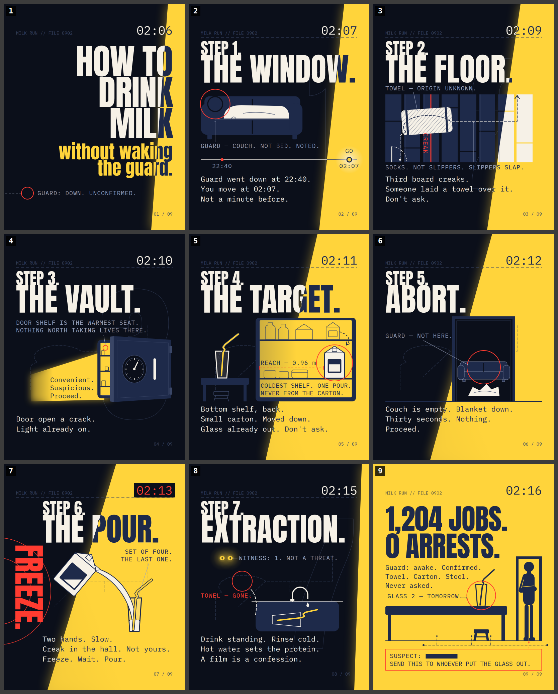

# MILK RUN

An Instagram carousel on how to drink milk, told as a dead-serious heist briefing.

> A dead-serious heist briefing for stealing one glass of milk at 02:07, every step oddly convenient, one step nearly aborted, until the last slide files the truth in the same flat voice: the guard was awake the whole time, set the job up, and has already put out tomorrow's glass.

9 slides, 4:5 portrait (1080 x 1350 px), pure HTML/CSS/inline SVG, no photos, no AI imagery. Rendered PNGs are in `export/`, ready to upload in order.



## Why this concept

The topic is mundane on purpose. The concept does the work: every real tip about drinking milk (which shelf is coldest, why you never drink from the carton, why you rinse the glass cold) is filed as heist INTEL, the "crew" is never drawn, and the last slide reveals in the same flat voice that the guard was awake the whole time and set the job up. Objects tell you who the crew is (a towel over the creaky board, a carton moved to a reachable shelf, a bendy straw, a step stool) before the final slide confirms it.

## Slides

### 01 · HOOK

**HOW TO DRINK MILK without waking the guard.**

Labels: `GUARD: DOWN. UNCONFIRMED.`

Alt text: A near-black slide with a bright yellow wedge of fridge light along the right edge. Huge white block letters, right-aligned, read HOW TO DRINK MILK, the K of MILK inside the light, and beneath them in yellow lowercase letters: without waking the guard. In the bottom-left corner a red circle is labelled GUARD: DOWN. UNCONFIRMED., with a dashed line running off the edge of the slide. The clock reads 02:06.

### 02 · BUILD

**STEP 1. THE WINDOW.**

```
Guard went down at 22:40.
You move at 02:07.
Not a minute before.
```

Labels: `GUARD — COUCH. NOT BED. NOTED.   //   GO   //   22:40   //   02:07`

Alt text: A dark slide dominated by a blue silhouette of someone asleep on a couch, a pale blanket over them, their head circled in red. A label beneath reads GUARD, COUCH, NOT BED, NOTED. Under the couch a thin timeline has two marks: 22:40 at the left and 02:07 at the right, where a glowing yellow dot labelled GO sits inside a wedge of fridge light. Text: Guard went down at 22:40. You move at 02:07. Not a minute before. Headline: STEP 1. THE WINDOW.

### 03 · BUILD

**STEP 2. THE FLOOR.**

```
Third board creaks.
Someone laid a towel over it.
Don't ask.
```

Labels: `CREAK   //   TOWEL — ORIGIN UNKNOWN.   //   SOCKS. NOT SLIPPERS. SLIPPERS SLAP.`

Alt text: A top-down floor plan of a hallway drawn as eight blue floorboards. A thin red line runs down the third board, labelled CREAK. A white striped towel lies across it, labelled TOWEL, ORIGIN UNKNOWN. A dashed white route starts at a small door symbol at the bottom, runs up the hall, hops the towel, and exits toward a wedge of yellow light. A note reads SOCKS. NOT SLIPPERS. SLIPPERS SLAP. Text: Third board creaks. Someone laid a towel over it. Don't ask. Headline: STEP 2. THE FLOOR.

### 04 · BUILD

**STEP 3. THE VAULT.**

```
Door open a crack.
Light already on.
```

Labels: `Convenient. Suspicious. Proceed.   //   INTEL — DOOR SHELF IS THE WARMEST SEAT. NOTHING WORTH TAKING LIVES THERE.`

Alt text: A refrigerator drawn as a bank vault: a blue box with a round dial handle, its door angled open so a strip of yellow light spills across the floor. In the light, three monospace words are stacked: Convenient. Suspicious. Proceed. A note above says the door shelf is the warmest seat and nothing worth taking lives there. Text: Door open a crack. Light already on. Headline: STEP 3. THE VAULT.

### 05 · BUILD

**STEP 4. THE TARGET.**

```
Bottom shelf, back.
Small carton. Moved down.
Glass already out. Don't ask.
```

Labels: `REACH — 0.96 m   //   INTEL — COLDEST SHELF. ONE POUR. NEVER FROM THE CARTON.`

Alt text: The inside of a refrigerator drawn in blue outlines, with ghosted bottles on the top shelf. On the bottom shelf a small white milk carton glows inside a red target circle; a dashed arrow shows it was moved down from the top shelf. A red dashed line at the carton's height is labelled REACH 0.96 m. A note says coldest shelf, one pour, never from the carton. On a counter at the left an empty glass waits with a bendy straw already in it, and a faint outline of a step stool sits beneath. Text: Bottom shelf, back. Small carton. Moved down. Glass already out. Don't ask. Headline: STEP 4. THE TARGET.

### 06 · BUILD

**STEP 5. ABORT.**

```
Couch is empty. Blanket down.
Thirty seconds. Nothing.
Proceed.
```

Labels: `GUARD — NOT HERE.`

Alt text: A dark kitchen with a tall blue doorway frame. Through the doorway, in darkness, the couch from earlier is empty and a pale blanket lies crumpled on the floor. A red circle around the empty cushion is labelled GUARD, NOT HERE. Text: Couch is empty. Blanket down. Thirty seconds. Nothing. Proceed. Headline: STEP 5. ABORT. The clock reads 02:12.

### 07 · TWIST

**STEP 6. THE POUR.**

```
Two hands. Slow.
Creak in the hall. Not yours.
Freeze. Wait. Pour.
```

Labels: `FREEZE.   //   SET OF FOUR. THE LAST ONE.`

Alt text: A tilted white milk carton with a dark label panel pours a curving white stream into a glass with a bendy straw. The word FREEZE runs down the left margin in tall red letters, with two red rings radiating from the edge behind it. A label by the glass reads SET OF FOUR. THE LAST ONE. The corner clock has turned red and reads 02:13. Text: Two hands. Slow. Creak in the hall. Not yours. Freeze. Wait. Pour. Headline: STEP 6. THE POUR.

### 08 · PAYOFF

**STEP 7. EXTRACTION.**

```
Drink standing. Rinse cold.
Hot water sets the protein.
A film is a confession.
```

Labels: `WITNESS: 1. NOT A THREAT.   //   TOWEL — GONE.`

Alt text: A dark kitchen. Two small yellow dots glow in the upper-left dark, labelled WITNESS: 1. NOT A THREAT. Below, a blue sink holds an empty glass on its side with a bendy straw sticking out, drawn in thin white outline. A dashed route retreats from the sink to a red circle around empty floor, labelled TOWEL, GONE. The fridge light is a thin sliver. Text: Drink standing. Rinse cold. Hot water sets the protein. A film is a confession. Headline: STEP 7. EXTRACTION.

### 09 · CLOSE

**1,204 JOBS. 0 ARRESTS.**

```
Guard: awake. Confirmed.
Towel. Carton. Stool.
Never asked.
```

Labels: `GLASS 2 — TOMORROW.   //   SUSPECT: ▮▮▮▮▮▮▮▮   //   SEND THIS TO WHOEVER PUT THE GLASS OUT.`

Alt text: The palette flips: a warm yellow kitchen with everything drawn in dark blue. Huge letters read 1,204 JOBS. 0 ARRESTS. Text beneath: Guard: awake. Confirmed. Towel. Carton. Stool. Never asked. A tall adult silhouette stands in a doorway at the right, arm folded, the counter at their hip. On the counter a second clean glass with a straw is circled in red and labelled GLASS 2, TOMORROW, and a small step stool is pushed against the counter beneath it. An evidence tag at the bottom reads SUSPECT with the name blacked out, then in red: SEND THIS TO WHOEVER PUT THE GLASS OUT. The clock reads 02:16.

## Caption

```
MILK RUN. Go time is 02:07.
Swipe to the end. Then go back to the towel.
Save this for tonight. You will be up anyway.
Send it to whoever put the glass out. They still won't ask.

#milkrun #howtodrinkmilk #2am #midnightsnack #heist #fridgelight #glassofmilk #graphicdesign #typography
```

## Design system

| Colour | Hex | Use |
|---|---|---|
| Fridge Dark | `#0B0F1A` | Background of slides 1 to 8. The kitchen at 2 a.m. Never pure black, so the wedge has something to glow against. |
| Bulb | `#FFD43B` | The fridge-light wedge, the straw, the GO dot, the witness eyes, the hook sub-line 'without waking the guard.', and the entire ground of slide 9. The only warmth on screen. |
| Milk | `#F6F1E7` | All headline and body type on dark slides, the glass, the pour, the carton body, the towel, the blanket. Reserved: nothing else is this light, so the eye finds the milk first. |
| Duvet Blue | `#1E2A4A` | Silhouettes, shelves, counter, sink, fridge body, floorboards, the carton's label panel, the doorway frame, the stool. On slide 9 it becomes the type and figure colour on Bulb. |
| Alarm | `#FF3B30` | Target circles, the CREAK hairline, the FREEZE word, the 02:13 timestamp, the TOWEL — GONE circle, the SEND line. Used small and rationed so the full-size FREEZE on slide 7 is the only time it goes big. |
| Ghost Light | `#9AA3BD` | All INTEL notes, map labels and leader lines. Roughly 7:1 on Fridge Dark; legible on a dim phone. This tier carries the actual milk knowledge, so it must be readable. |
| Ghost | `#3A4666` | Chrome only: outlined step numerals, persisted route lines from earlier slides, dimmed items on the top shelf, header file number, slide counter. Never used for anything the reader needs to read. |

**Display font:** Anton (Google Fonts; fallback Impact, 'Arial Narrow Bold', sans-serif)  
**Body font:** IBM Plex Mono (Google Fonts; fallback 'Courier New', monospace)

**Recurring motif:** The wedge of fridge light. A clip-path trapezoid anchored to the right edge with the hinge implied off-canvas: polygon(calc(100% - W) 100%, 100% 100%, 100% 0, calc(100% - W/2) 0), so at any height the light is at least half its bottom width and actually reaches the things it is said to touch. Filled with linear-gradient(250deg, #FFD43B 0%, rgba(255,212,59,0.55) 45%, transparent 100%). W grows every slide as the door opens and the timestamp ticks with it, two clocks running: S1 W 200 (02:06), S2 300 (02:07, the GO dot sits inside it), S3 400 (02:09), S4 500 (02:10, the wedge is the crack between vault door and body), S5 620 (02:11), S6 740 (02:12), S7 820 (02:13, timestamp in Alarm), S8 snaps back to a 90 px sliver (02:15, the door pushed shut), S9 floods the full canvas (02:16) and the palette inverts: Bulb ground, Duvet Blue shapes and type. Second accumulating motif: the route. A fixed base path drawn on slide 3 (in from the hallway door at the bottom of the floor plan, up the boards, over the towel, out toward the fridge at top-right) persists at the same canvas position in Ghost at 40 percent on every later slide, confined to the illustration band so it never sits under body text; each slide adds one terminal segment (to the vault, to the counter, to the sink, back out). On slide 9 the whole path is redrawn dashed in Duvet Blue: the guard's own diagram of the job.

**Illustration style:** Flat two-tone silhouette vector built only from CSS boxes, border-radius, clip-path polygons and short inline SVG paths. Rectangles for fridge, counter and sink; the carton is a Milk rounded rect with a triangular gable and a Duvet Blue label panel on its face (the panel is the window through which the milk level is drawn, so a Milk fill is never invisible against a Milk carton); a trapezoid for the glass; a Bulb path with a three-segment zigzag elbow for the bendy straw; a Duvet Blue rectangle outline 360 by 520 for a doorway (planted on slide 6, paid off on slide 9); a small Duvet Blue step stool (a 90 by 24 top with two splayed legs) planted as a Ghost outline on slide 5 and drawn solid on slide 9. Everything lives in Duvet Blue on Fridge Dark except what the light wedge touches: inside the wedge, duplicated shapes flip to Milk and Bulb, clipped by the same polygon as the wedge. Heist-map language on every slide: SVG dashed lines (stroke-dasharray 14 10) for routes, Alarm circles (stroke 4 px, no fill) for targets, mono labels with a thin leader line ending in a 6 px dot. No faces, no hands, no hair. The crew is never drawn; its size is stated only by objects (towel on the board, carton moved down, REACH 0.96 m, two hands, bendy straw, stool) until slide 9 gives it an adult to stand next to.

## Files

- `index.html`: all nine slides stacked; open it in a browser to preview. Generated by `build.js`; edit the generator and run `node build.js` rather than editing the HTML by hand.
- `preview.png`: contact sheet of all nine slides.
- `export/slide-01.png` … `export/slide-09.png`: the upload-ready renders.
- `script.json`: the production script (copy, art direction, layout coordinates, alt text) the slides were built from.
- `render.cjs`: Playwright renderer.
- `CONCEPTS.md`: the 12 competing concepts and how they ranked.

## Re-rendering

```bash
npm i -g playwright   # the renderer requires it from the global node_modules
node build.js                          # regenerate index.html
node render.cjs index.html export slide   # export/slide-01.png … slide-09.png
```

The renderer screenshots every `.slide` element at exactly 1080 x 1350 after Google Fonts have loaded, so it needs network access the first time.
